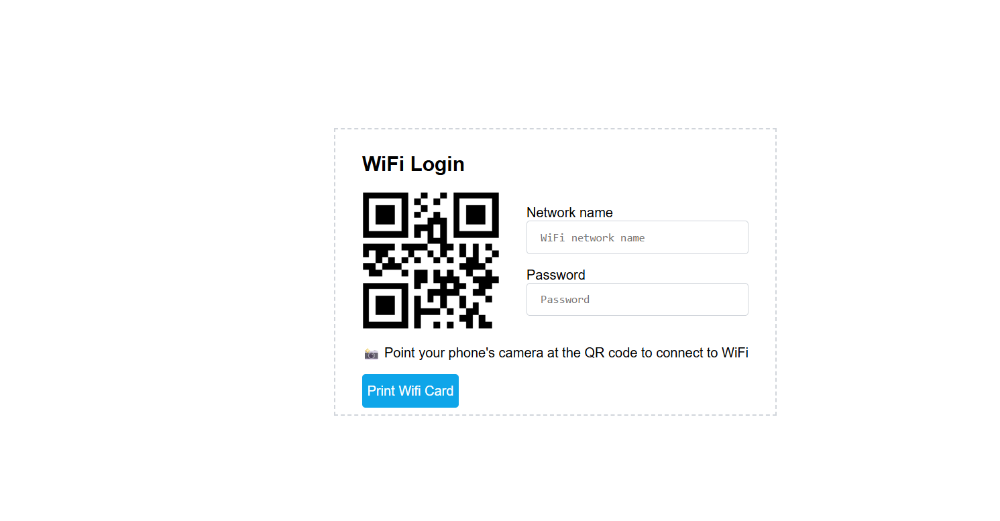

# Wi-Fi Card Generator

**A simple client-side Wi-Fi card and QR generator (HTML / CSS / JavaScript — vanilla).**

> Small utility that creates a QR code and print-friendly card for any Wi-Fi network. Everything runs in the browser — no server involved.

---

## Features
- SSID (network name) input  
- Security type: `WPA` / `WEP` / `Open (nopass)`  
- Hidden SSID toggle  
- Browser-based QR generation (via QRCode.js CDN)  
- Live card preview  
- Copy Wi-Fi string button  
- Download card as PNG  
- Print / Save as PDF  

---

## 📸 Screenshots

### 🔹 Form View

### 🔹 Generated Wi-Fi Card

